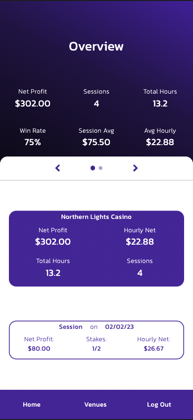
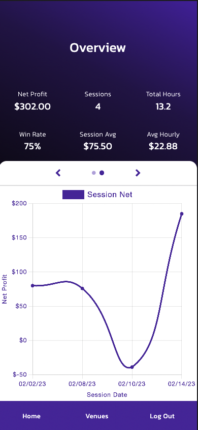
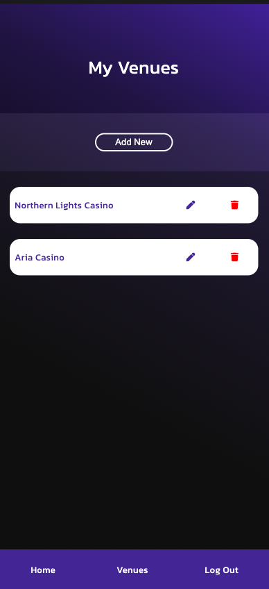
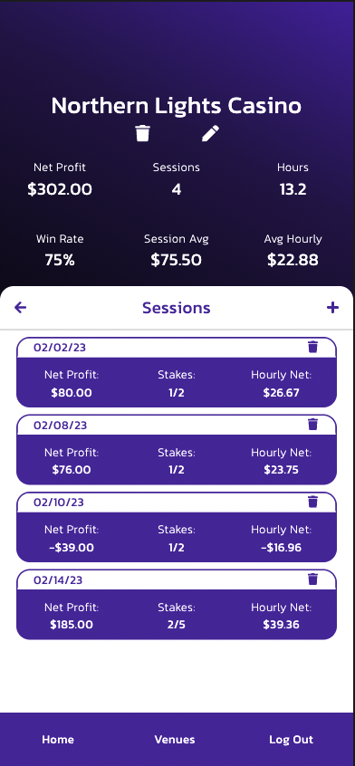
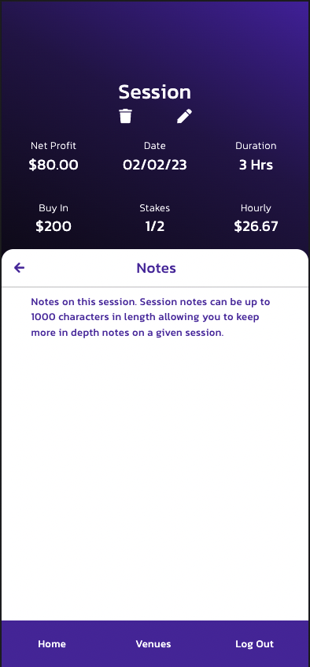
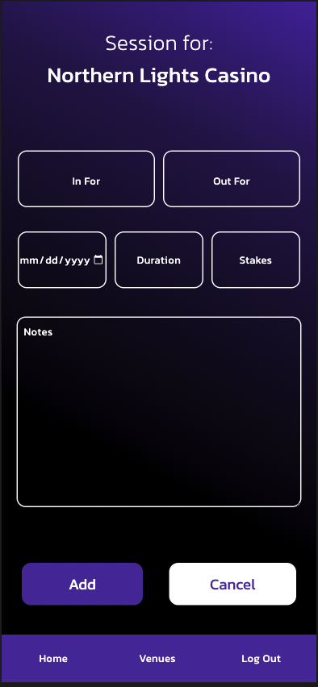

# MyPokerStats

MyPokerStats is your all in one poker stat tracking application. This app will take your poker game to the next level by taking in information from each session you play, and showing you stats to look at to improve your awareness as to how each of your sessions go. You will see stats such as your net profit for each session, for each venue you play at, and at all venues across all sessions. It also tracks your hourly win rate, your win percentage as well as notes and what stakes you played at for each session.

## Technologies Used

This application was built using the following technologies:

- React.js
- CSS
- PostgreSQL
- Express.js
- Node.js
- Webpack
- React Icons
- Redux
- Chart.js

## How to use

This application is very simple and easy to use. Here is how to get the most out of MyPokerStats

A few things to note:

There are three different stats views for this application

1. Overview Page

This page will show you your stats across all sessions and venues giving you a view of all data gathered from the application. There is a graph on this page as well which shows you your profit trend across the last few sessions you play to show if you are on a downswing or upswing

2. Venue Page

Here you will see the stats for this specific venue that you play at. You can have multiple venues for a more in depth look as to which venue you played at for a given session so you are able to break down what venue you play the best at. These stats will be the same as the overview page but for only that venue

3. Session Page

This is where you can view each individual session you play. You will see what you bought in for and what you cashed out for, how long you played, the date and stakes you played at as well as any notes that you input for that session. All of these are editable if you happened to input the wrong information

To be able to track your stats you will be prompted to either log in or register an account. You will not be able to use the application without being logged in. After logging in, there will be instructions as to what you should do next but to sum it up:

1.  Create a venue
2.  Create a session for that venue
3.  Look at stats from that session or multiple sessions that you created

You are able to see a list of the created venues where you can click on a venue to go to that venues page, or you are can edit the name and delete a venue from that list. You are also able to edit or delete a venue from the venue overview page, but be warned if you want to delete a venue, it will delete every session associated with it.

If you want to edit or delete a session you can do that on the session view page where you are able to change anything about that session

## Instructions for Cloning

If you would like to look at this project in your own editor here is how you do that:

1. Clone the repository and open in your editor of choice
2. Open your database tool and grab the database.sql files content and create the tables.
   The order you create these tables are as follows:
   - user
   - venue
   - session
3. Go into the pool file and make sure your databases name is the same as the one in your database tool
4. After setting up the database and connecting it, make sure you run `npm install` to grab all of the tools used in your package.json file
5. Start the server by running the command `npm run server`
6. Start the client by running the command `npm run client`

## Screenshots

